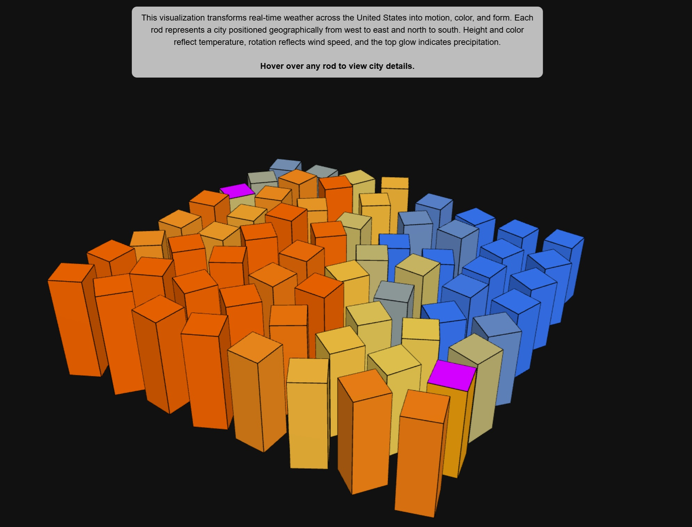

# Weather as Motion




A living map of weather.

This project transforms real-time atmospheric data across the United States into motion, color, and form. Instead of charts or dashboards, weather is experienced as a dynamic, spatial system.

## The idea

Each vertical rod represents a U.S. city, positioned geographically from west to east and north to south. As conditions change, the sculpture continuously reshapes itself.

- **Temperature** becomes height and color  
- **Wind** becomes motion  
- **Precipitation** becomes light  

Patterns emerge across the grid—heat rises, storms pulse, and wind fields rotate—revealing the invisible behavior of the atmosphere.

## Interaction

Hover over any rod to explore:
- City name  
- Temperature (°C / °F)  
- Wind speed and direction  
- Precipitation type and intensity  

## Why this exists

I wanted to explore how real-time data can become something physical and expressive.

Most data visualizations aim for clarity.  
This aims for presence.

## Tech

- Three.js  
- JavaScript  
- Open-Meteo API  

## Live

https://dupeone.github.io/weather-as-motion/


## Run locally

Because this uses live API data, run it with a local server.

### VS Code

Use **Live Server** on `index.html`


### Python

```bash
python -m http.server 8000

Then open:

http://localhost:8000


